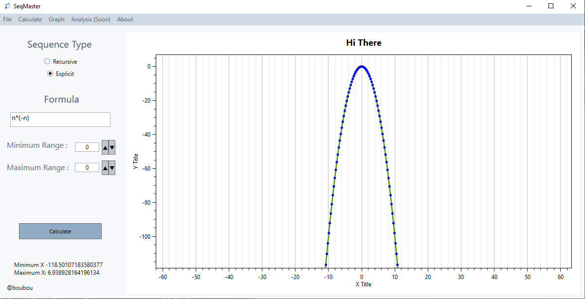

# 📈 SeqMaster

SeqMaster is an application  designed to calculate and visualize mathematical sequences using graphs.

(No source code at the moment.)
# 🚀 Features

1. ### Calculate Explicit Sequences

In the form of : *n + x*

2. ### Calculate Recursive Sequences

(Before you enter the first term U0)

In the form of : *Un + x*

2. ### Infinite or Custom range ?

You can choose between a __custom__ range and an __infinite__ range. To enable the infinite range set both *Minimum* and *Maximum* range to 0

⚠️ If you have a large limited range, it is better to use the infinite range (optimization reasons)

3. ### Export Picture

The graph can be exported as a PNG or JPEG image.

4. ### Import / Export your data

- formula, graph customizations and range can be saved as a JSON file.

- Export to a CSV file and use with Excel or other applications

- Import a CSV file to view the graph 

# ⚙ Technologies Used

- #### Language : C#

- #### Framework : WPF (.NET) 6.0

- #### Libraries used : NCalc / OxyPlot

# 🖼 Screenshot

### Main Menu :

# Version 1.0

# 🙂 Help Me Improve

To help me improve, you can try my application and let me know about any issues you encounter.

You can also suggest me new features to add or share new project ideas
